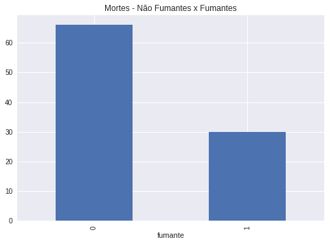

# dataenginneer_heart_failure
Estudo de caso Análise Exploratória - Insuficiência Cardíaca

Efetuado usando a linguagem Python + Bibliotecas Pandas / Matplotlib / plotly

Base de dados usada: https://www.kaggle.com/andrewmvd/heart-failure-clinical-data

Legenda dados:

Sexo - Masculino = 1, Feminino =0

Diabetes - 0 = Não, 1 = Sim

Anemia - 0 = Não, 1 = Sim

Fumante - 0 = Não, 1 = Sim

Morte - 0 = Não, 1 = Sim

#QUANTIDADE DE LINHAS E COLUNAS
(299, 13)

#Quantidade de Pacientes Analisados
299

#Média de idade morte
65.208333

#idade minima
40

#idade máxima
95

#Quantidade de Não Fumantes e Fumantes

Não Fumantes    66

Fumantes    30

